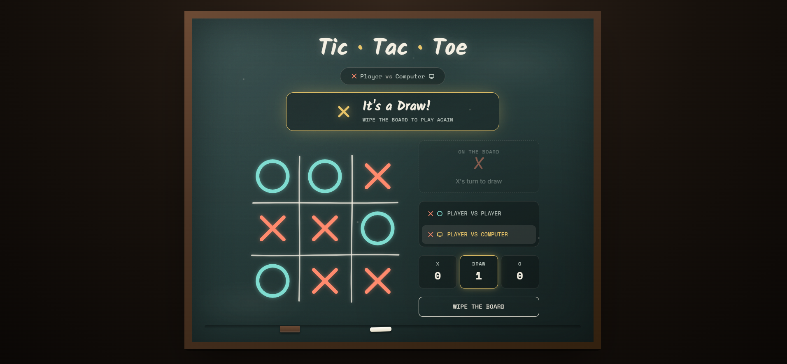

# SCT_WD_3 — Tic-Tac-Toe Web Application

Web Development Internship (Task 03) — a fully interactive, two-player and vs-computer tic-tac-toe game

A polished, chalkboard-themed tic-tac-toe web application built from scratch with HTML5, CSS3, and Vanilla JavaScript — no frameworks, no libraries. Play against a friend or challenge an unbeatable computer opponent.

**Project:** Web Development Internship — Task 03

## 📖 About the Project

This project is a modern implementation of the classic Tic-Tac-Toe game featuring both Player vs Player and Player vs Computer modes. It demonstrates JavaScript game logic, DOM manipulation, responsive web design, animations, and AI decision-making using the Minimax algorithm while providing an engaging user experience.

🌐 **Live Demo:** https://radhika200gupta-tech.github.io/SCT_WD_3/

## 📸 Project Preview



## 🚀 Features

- **Chalkboard-style design** — hand-drawn grid lines, chalk dust texture, and a wooden frame for a warm, tactile look
- **Two game modes** — Player vs Player and Player vs Computer, switchable at any time
- **Unbeatable AI opponent** — computer moves are calculated with the minimax algorithm, so it never loses
- **Animated marks** — X's and O's draw themselves onto the board stroke by stroke
- **Win detection with highlight** — the winning line is drawn across the board and the winning cells glow
- **Win announcement banner** — a celebratory banner with a confetti burst appears above the board on every win or draw
- **Live scoreboard** — tracks X wins, O wins, and draws across rounds
- **Wipe the board** — reset the current round without losing the running score
- **Fully responsive** — the board, panel, and banner all adapt cleanly to mobile screens
- **Accessible** — proper ARIA labels on the grid and cells, keyboard-focus states, and `prefers-reduced-motion` support

## 📁 Folder Structure

```
SCT_WD_3/
├── index.html      # Markup and structure
├── style.css       # Styling, theming, and animations
├── script.js       # Game logic, minimax AI, and interactivity
├── game.png        # Project preview screenshot
└── README.md       # Project documentation
```

Three files, no build tools, no dependencies.

## 🧩 Sections Included

- Header (title + current mode banner)
- Win announcement banner (appears on win/draw)
- 3×3 game board with animated chalk-drawn grid
- Side panel: turn indicator, mode toggle, scoreboard, and reset button

## 🎨 Design Tokens

| Token | Value |
|---|---|
| Board Background | `#263a39` |
| Frame Wood | `#4a3324` |
| Chalk White (text) | `#f4efe2` |
| X Color (Coral) | `#ff8a6d` |
| O Color (Cyan) | `#7fdcd0` |
| Accent (Yellow) | `#e8c468` |
| Font (display) | Kalam (Google Fonts) |
| Font (mono/labels) | Space Mono (Google Fonts) |
| Font (body) | Inter (Google Fonts) |

## 🛠️ Tech Stack

- **HTML5** — semantic markup
- **CSS3** — custom animations, grid & flexbox, no framework
- **Vanilla JavaScript (ES6+)** — no libraries, minimax algorithm implemented from scratch
- **Google Fonts** — Kalam, Space Mono & Inter (via CDN)

## ▶️ How to Run

No build tools or dependencies required.

1. Download or clone this repo
2. Keep `index.html`, `style.css`, and `script.js` in the same folder
3. Open `index.html` directly in your browser

> Note: Google Fonts load via network requests, so an internet connection is needed for the page to look correct.

## 📌 Notes

- The computer opponent is unbeatable — it uses the minimax algorithm to evaluate every possible outcome before choosing a move.
- Scores persist only for the current session and reset when the mode is switched or the page is reloaded.
- Accessibility basics included: `role="grid"` on the board, `aria-live` regions for status updates, and reduced-motion support.

## 👤 Author

**Radhika Gupta**
Frontend Developer | Web Development Enthusiast

Built as part of my Web Development Internship (Task 03) at SkillCraft Technology.
